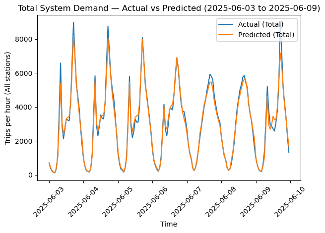

# ⛈️ **Cloudy with a Chance of BIXI** 🚲
Hourly Bike-Sharing Demand Forecasting for BIXI Montréal

End-to-end machine learning project that forecasts hourly bike demand per station to support rebalancing and capacity planning.

Key result:
➡️ MAE ≈ 2 trips per station per hour on 2025 out-of-sample data

🔗 **Live demo:** https://cloudy-with-a-chance-of-bixi.streamlit.app/

## ⚡ **TL;DR (30 seconds)**

Problem: Stations run empty or full → lost trips & operational inefficiencies

Solution: Tree-based ML forecasting hourly demand at the station level

Data: Trips + weather + time + spatial features

Final model: Histogram-based Gradient Boosting

Performance: MAE ≈ 2 trips/hour, R² ≈ 0.65 (2025 backtest)

Interpretability: SHAP explains demand drivers

Outcome: Actionable forecasts for rebalancing & planning

## 🚀 **Quick Start**

1. Setup Environment
```bash
# Clone the repository
git clone https://github.com/yipyiphouray/cloudy-with-a-chance-of-bixi.git
cd cloudy_with_a_chance_of_bixi

# Install dependencies
pip install -r requirements.txt

# Run the Streamlit app
streamlit run app/BIXI_streamlit_app.py
```
## 🖥️ Interactive Application (Streamlit)

* The Streamlit dashboard allows users to:
* Select any BIXI station in Montréal
* Predict demand for a single hour
* Generate a recursive 24-hour forecast using user-defined weather assumptions
* Visualize station location on a map
* Inspect 2025 backtesting performance
* Understand why a prediction was made using lightweight explainability

This mirrors how demand forecasts would be consumed in a real operational setting.

## 📁 Project Structure
```text
├── app/                          # Streamlit dashboard source code
├── data/                         # Minimal processed artifacts for the live demo
├── figures/                      # Model evaluation plots
│   ├── BIXI_SHAP_PLOT.png        # Feature importance (SHAP)
│   ├── BIXI_Feature_Importance.png   # Global feature ranking
│   ├── Residual_Distribution.png     # Error analysis plot
│   └── OneWeekTimeSeries.png         # Actual vs. Predicted comparison
├── models/                       # Serialized model binaries (.pkl)
│   ├── hgb_BIXI_DemandForecast_model_v1.pkl     # Final HGB model (Lightweight)
├── notebooks/                    # End-to-end data science pipeline
│   ├── 01_Data Cleaning.ipynb
│   ├── 02_Initial EDA.ipynb
│   ├── 03_Feature Engineering.ipynb
│   ├── 04_Post-FE_EDA.ipynb
│   ├── 05_Modeling.ipynb
│   └── 06_Backtesting_forecast.ipynb
├── report/                       # Formal documentation
│   └── BIXI_Demand_Forecasting_Full_Report.pdf
├── .gitignore                    # Prevents large data/model uploads
├── README.md                     # Project overview and instructions
└── requirements.txt              # Environment dependencies
```

## 📊 Data & Model Note

This repo includes the **minimal artifacts required to run the Streamlit demo**:

- `data/processed/model_df.parquet` (~61MB)
- `data/processed/forecast_2025.parquet` (~54MB)
- `models/hgb_BIXI_DemandForecast_model_v1.pkl` (~1.5MB)

Large raw/processed datasets are excluded to keep the repo lightweight:

- `data/raw/*.csv` (2–3GB each)
- `data/processed/bixi_trip_data*.parquet` (300–600MB)
- `models/rf_*.pkl` (≈385MB)

### To Run Locally:

Reproducing the Full Pipeline

1. Download trip data from the BIXI Open Data Portal

2. Place CSVs in data/raw/ and name them BIXI_Trip_YYYY.csv

3. Run notebooks 01 → 04 to regenerate processed datasets

4. The Streamlit app uses the Histogram-based Gradient Boosting model by default

## 🧠 **Feature Engineering (Highlights)**

Temporal patterns

Hour, day-of-week, month

Cyclical encoding transforms periodic features into 2D space, ensuring the model perceives the distance between 23:00 and 00:00 as 1 hour rather than 23 hours

Demand inertia

Lagged demand (1h, 24h)

Rolling averages (3h, 24h)

Weather effects

Feels-like temperature

Rain indicator

Spatial context

Latitude & longitude (neighborhood effects)

⚠️ All lag and rolling features are computed strictly within each station’s time series to prevent leakage.

## 🤖 **Models & Performance**
| Model | MAE | RMSE | $R^2$ | Training Time |
| :--- | :--- | :--- | :--- | :--- |
| Baseline (Mean) | 3.22 | 4.60 | $-0.001$ | ~0 s |
| Random Forest | 2.05 | 3.15 | 0.645 | ~9 min |
| **HistGradientBoost (Final)** | **2.04** | **3.14** | **0.648** | **~40 s** |

✔ Same accuracy as Random Forest
✔ ~13× faster training
➡ Selected for production practicality

## 🔍 **Model Interpretability (SHAP)**

Key drivers of hourly demand:

Recent usage dominates (strong temporal persistence)

Clear daily cycles (commute patterns)

Spatial effects matter (downtown vs residential)

Weather is secondary

Calendar effects are minor

Demand follows stable routines; weather adjusts demand but rarely overrides time-based patterns.


## 📈 **2025 Walk-Forward Forecast (Backtest)**

The final model was applied to 2025 data in a walk-forward forecasting setup.

2025 Performance:

MAE: 1.97

RMSE: 3.12

R²: 0.646

This confirms strong generalization to unseen future periods.



## 💼 **Why This Matters**

With an average error of ~2 trips per station per hour, forecasts can support:

🚚 Proactive rebalancing

🏗️ Capacity planning

👥 Staffing & logistics optimization

At peak hours (10–40 trips/hour), this level of accuracy is operationally meaningful.

## 🧩 Example Operational Use Case
At a downtown station averaging ~25 trips/hour during peak periods,  
a 2-trip/hour error represents <10% relative error.

This accuracy level enables:
- Early rebalancing before stations fully empty
- Better prioritization of high-risk stations
- Reduced reactive truck dispatching during peak hours

## ⚠️ **Limitations & Future Work**

### Limitations

No explicit event data (festivals, disruptions)

Rebalancing actions not modeled

Hourly (not real-time) resolution

### Future improvements

Event & transit disruption features

Richer spatial context (zones, transit proximity)

Shorter time intervals (15-min forecasting)

## 🏭 **Production Considerations**

While this project is presented as a portfolio demo, several design choices were made with production constraints in mind:

- Lightweight final model (HGB) for fast retraining and inference
- Explicit train/validation/test temporal splits to prevent leakage
- Recursive forecasting logic aligned with real operational usage
- Minimal data artifacts committed to version control
- Streamlit app structured around model inputs/outputs, not notebooks

In a production environment, this system could be extended with:
- Scheduled retraining (weekly/monthly)
- Automated weather ingestion
- Monitoring for prediction drift

## 🛠 **Tech Stack**

Python · pandas · scikit-learn · SHAP · Meteostat API ·
numpy · matplotlib · seaborn · Streamlit

## 📄 **Full Report**

📂 report/BIXI_Demand_Forecasting_Full_Report.pdf